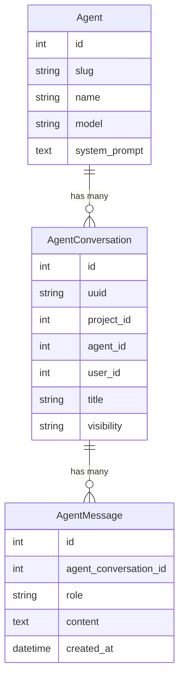
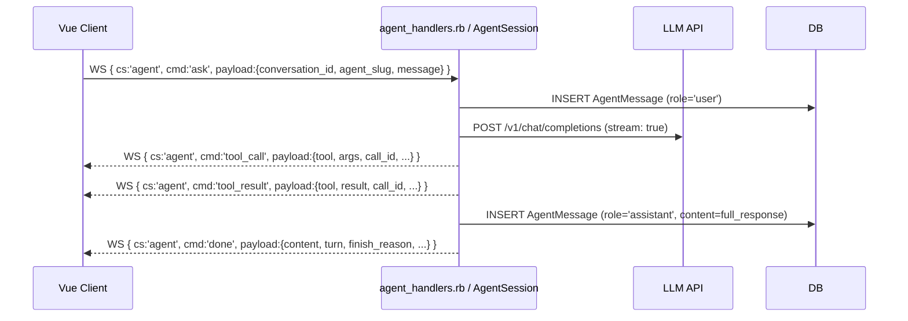

## Overview

CARB/IDE2's agent system lets users interact with LLMs from within the workspace.
Conversations are stored in Postgres and surfaced to the client over the `agent`
WebSocket commandSet.

## Data model

### `Agent`

Defines an LLM persona: model, system prompt, tool allowlist. Agents are
workspace-global (not per-project); `slug` is the stable client-facing id.

### `AgentConversation`

A persisted conversation thread (project + user + agent). `uuid` is the
client-facing id; `visibility` is `project` (any member can read and post) or
`private` (owner only).

### `AgentMessage`

One message in a conversation. `role` is one of `system`, `user`, `assistant`,
or `tool` — the OpenAI chat-completion roles, including tool calls and results.

## LLM relay

The worker runs the tool-call loop against the configured OpenAI-compatible
endpoint (LM Studio in local dev, or a remote provider in production). Each
turn is a single non-streaming completion request today; tool calls are
executed worker-side and surfaced as `agent/tool_call` / `agent/tool_result`
events.

## Local dev relay

`scripts/dev-lmstudio-relay.sh` proxies requests to a local LM Studio instance,
allowing offline agent use during development.

## Source files

| File | Role |
|------|------|
| `app/models/agent.rb` | Agent model |
| `app/models/agent_conversation.rb` | Conversation model |
| `app/models/agent_message.rb` | Message model |
| `worker/handlers/agent_handlers.rb` | WS commandSet handlers (`list`, `recent`, `load`, `ask`, …) |
| `worker/agent_session.rb` | In-memory tool-call loop per conversation |
| `scripts/dev-lmstudio-relay.sh` | Local LLM relay script |
