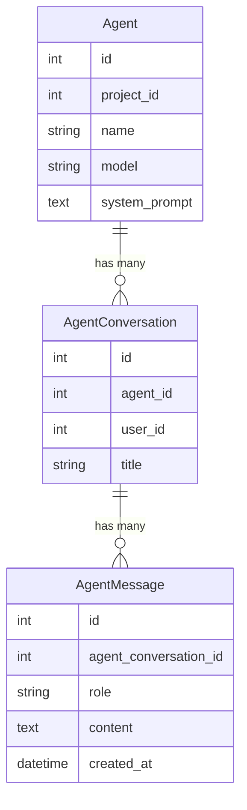
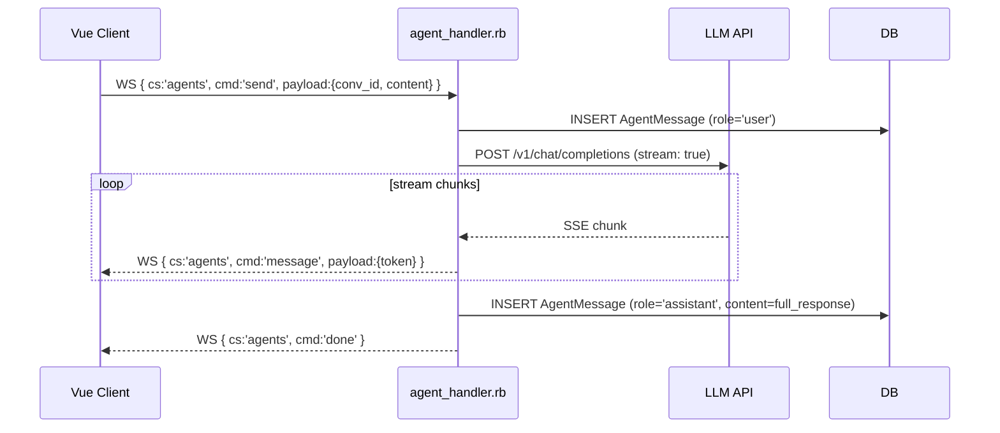

## Overview

Carbide2's agent system lets users interact with LLMs from within the workspace.
Conversations are stored in Postgres and streamed to the client over the `agents`
WebSocket commandSet.

## Data model

### `Agent`

Defines an LLM persona: model, system prompt, name. Scoped to a project.

### `AgentConversation`

A single conversation thread between a user and an agent. One conversation can have
many messages.

### `AgentMessage`

One message in a conversation. `role` is `"user"` or `"assistant"`.

## LLM relay

The worker streams responses from the configured LLM endpoint (LM Studio in local dev,
or a remote OpenAI-compatible endpoint in production).

## Local dev relay

`scripts/dev-lmstudio-relay.sh` proxies requests to a local LM Studio instance,
allowing offline agent use during development.

## Source files

| File | Role |
|------|------|
| `app/models/agent.rb` | Agent model |
| `app/models/agent_conversation.rb` | Conversation model |
| `app/models/agent_message.rb` | Message model |
| `worker/agent_handler.rb` | WS commandSet handler + LLM streaming |
| `scripts/dev-lmstudio-relay.sh` | Local LLM relay script |
