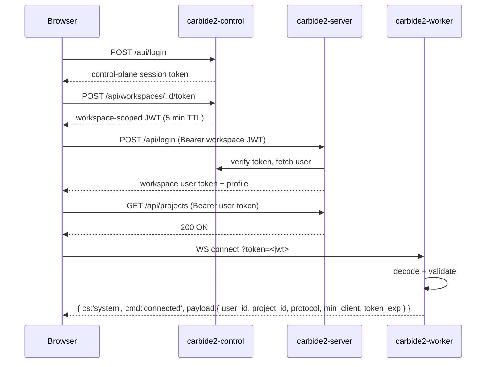

## Token issuance

All tokens are HS256, signed with the shared `WORKER_JWT_SECRET`. In Kubernetes
the secret lives in the `workspace-jwt` Secret, which the control-plane operator
mirrors into every `ws-<id>` namespace. The authoritative wire format is
`JWT_CLAIMS.md`, mirrored by hand in both `carbide2-server` and `carbide2-control`.

| Context | Issuer | Purpose |
|---------|--------|---------|
| Dashboard login | `carbide2-control` (`POST /api/login`) | Control-plane session for the dashboard SPA |
| Workspace bootstrap | `carbide2-control` (`POST /api/workspaces/:id/token`) | Short-lived (5 min) workspace-scoped token the browser presents to the workspace pod |
| Workspace session | `carbide2-server` (`POST /api/login`) | Exchanges the control-plane token for a workspace user token used on REST calls |
| Legacy worker token | `carbide2-server` `WorkerTokenIssuer` (`POST /api/projects/:id/ws_token`) | Server-minted WS token, kept while the control plane rolls out |

## Control-plane-minted claims (new format)

| Claim | Type | Example | Notes |
|-------|------|---------|-------|
| `iss` | string | `carbide-control` | Constant; the workspace rejects any other issuer |
| `sub` | string | `user:42` | `user:<control_plane_user_id>` |
| `aud` | string | `workspace:42` | `workspace:<project_id>`; the workspace rejects a mismatch |
| `exp` / `iat` | integer | — | Unix seconds; TTL is 5 minutes |
| `user_id` | integer | `42` | Control-plane DB primary key |
| `user_email` | string | — | Denormalized for display and audit |
| `project_id` | integer | `42` | Must match the `aud` suffix and `WORKSPACE_PROJECT_ID` |
| `scope` | string | `workspace:rw` | Currently always `workspace:rw` |

## Workspace-minted user token

After the control-plane exchange, the workspace auth controller issues its own
user token for subsequent REST calls:

| Claim | Notes |
|-------|-------|
| `sub` | Local (workspace-DB) user id |
| `iat` / `exp` | Expiry from `WORKER_TOKEN_EXPIRY_SECONDS` (default 3600 s) |
| `scopes` | `["user:auth"]` |
| `control_user_id` / `control_user_email` | Carried through from the control-plane token |

## Legacy format (server-minted by `WorkerTokenIssuer`)

Accepted by the worker during the control-plane transition. Claims: `sub` and
`user` (both the user id), `name` (display name), `project` (project id), and
`exp`. No `iss`/`aud`. See `app/services/worker_token_issuer.rb`.

## Validation

Rails API validation (`Api::BaseController`):

1. Decode HS256 against `WORKER_JWT_SECRET`; expired or malformed tokens → 401.
2. Look up the user from the `sub` claim. A structurally valid token whose user
   does not exist in *this* pod's database (e.g. a token minted by a different
   workspace pod and replayed here) returns **401 "Token does not match a known
   user"** — deliberately not a 404.

The worker validates tokens in `worker/worker.rb` at WebSocket connect (and
again on in-band `system/reauth`), against the same secret:

1. Signature valid against `WORKER_JWT_SECRET`.
2. `iss == "carbide-control"` (new format) **or** no `iss` claim (legacy).
3. New format only, when `WORKSPACE_PROJECT_ID` is set: `aud` must equal
   `workspace:<id>`, `project_id` must match, and `scope` must be `workspace:rw`.
4. `exp > now`. An expiry sweep sends `system/token_expired`; clients refresh
   in-band via `system/reauth` without dropping the socket.

## Token flow diagram

