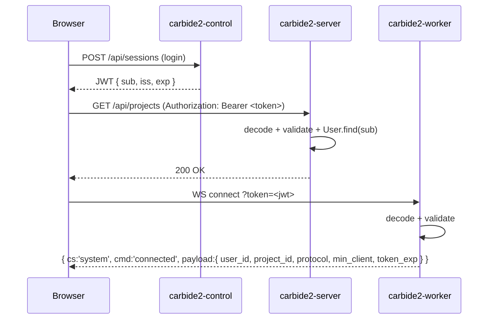

## Token issuance

Tokens are issued in two contexts:

| Context | Issuer | Purpose |
|---------|--------|---------|
| Login / signup | `carbide2-server` Rails auth controller | User session for the workspace SPA |
| Workspace provisioning | `carbide2-control` `WorkerTokenIssuer` | Short-lived token for worker process |

## Required JWT claims

| Claim | Type | Description |
|-------|------|-------------|
| `sub` | string | User ID (database primary key as string) |
| `iss` | string | Issuer — `"carbide2"` |
| `iat` | integer | Issued-at (Unix timestamp) |
| `exp` | integer | Expiry (Unix timestamp) |

## Worker-specific claims

The worker token additionally carries:

| Claim | Description |
|-------|-------------|
| `project_id` | Database ID of the workspace project |
| `workspace_id` | Control-plane workspace ID |
| `role` | `"worker"` — distinguishes from user tokens |

See `app/services/worker_token_issuer.rb` for issuance logic.

## Validation

Token validation on the Rails side:

1. Decode with the application secret key (`Rails.application.secret_key_base`)
2. Verify `iss == "carbide2"`
3. Verify `exp` is in the future
4. Look up `User.find(sub)` — a `RecordNotFound` here surfaces as a 404 (auth error masquerading as missing resource; a known gotcha)

Worker validates tokens in `worker/worker.rb` on WebSocket connection using the same secret.

## Legacy claims

Older tokens may carry `user_id` instead of `sub`. Both are accepted during a transition window. `sub` is canonical for new tokens.

## Token flow diagram

