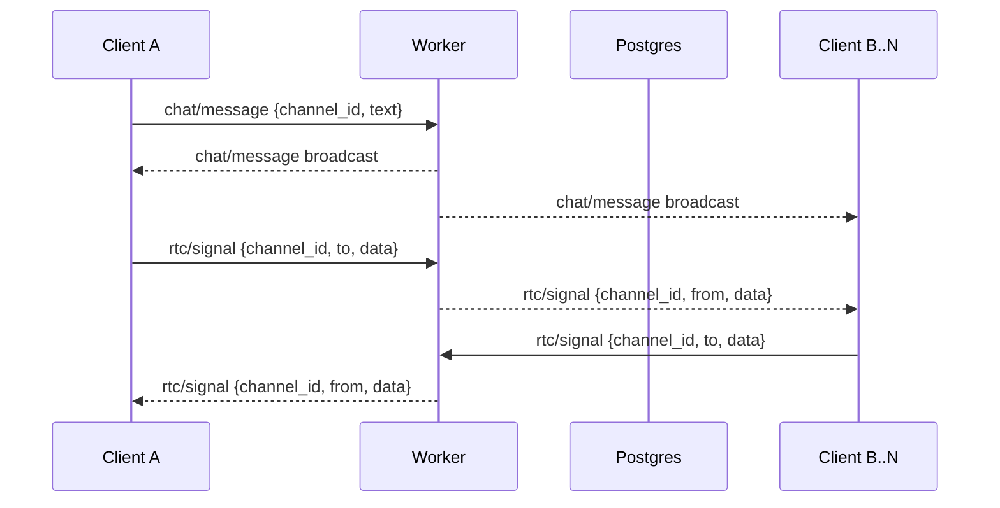

Chat is a first-class subsystem. VideoConference currently exists in a rudimentary
form and is coupled to chat room/session semantics.

## Coupling model

1. Room identity and membership are shared between chat and video signaling.
2. Chat events are durable (`chat_messages`); video signaling is ephemeral WS traffic.
3. Video session lifecycle is currently anchored to chat presence/channel context.

## Fanout semantics

### Broadcast and ordering guarantees (current)

| Channel | Durability | Ordering expectation | Delivery scope |
|---------|------------|----------------------|----------------|
| `chat/message` | Durable in DB | Per-channel insertion order | All connected subscribers in channel |
| `rtc/*` signaling | Ephemeral | Best-effort arrival order | Targeted peer(s) in same room |

## What is missing / expected evolution

1. Explicit reconnect and renegotiation UX for in-flight `rtc/*` messages.
2. Stronger delivery telemetry for targeted signaling fanout.

Contracts and guarantees:
- [RTC Signaling Contract](/api-reference/rtc-signaling/)
- [Realtime Guarantees](/architecture/realtime-guarantees/)
- [Security Model](/architecture/security-model/)
