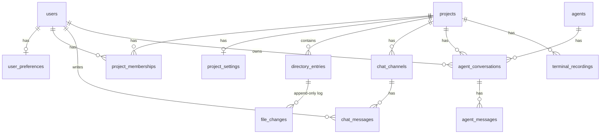

import { Aside } from '@astrojs/starlight/components';

The single Postgres database (CloudNative PG) is shared by Rails **and** the
EventMachine worker — both load the same ActiveRecord models. Source of truth:
`db/schema.rb` plus migrations in `db/migrate/`.

<Aside type="caution">
  Schema skew between Rails and the worker is a known risk — tracked in
  [issue #17](https://github.com/fdimitri/carbide2-server/issues/17)
  (expand/contract migration policy).
</Aside>

## Tables by subsystem

| Subsystem | Tables |
|-----------|--------|
| Identity & access | `users`, `user_preferences`, `projects`, `project_memberships`, `project_settings` |
| Filesystem (DBFS) | `directory_entries`, `file_changes` |
| Chat | `chat_channels`, `chat_messages` |
| Agents | `agents`, `agent_conversations`, `agent_messages` |
| Terminal | `terminal_recordings` |

## Entity relationships

## Filesystem (DBFS)

### `directory_entries`

One row per file or folder. Metadata only — content lives in the change log.

| Column | Type | Notes |
|--------|------|-------|
| `project_id` | bigint | FK; `(project_id, srcpath)` unique |
| `srcpath` | string | Absolute VFS path |
| `cur_name` | string | Current basename |
| `ftype` | string | `'file'` (default) or `'folder'` |
| `binary` | boolean | Binary-passthrough — reads go straight to VFS disk |
| `posix_mode` / `posix_owner` / `posix_group` | int / string / string | POSIX metadata, populated by `FsLoader` |
| `last_size`, `mtime` | bigint, datetime | stat-style properties for the explorer |
| `owner_id`, `created_by_id` | integer | User references |

### `file_changes`

Append-only mutation log. Current content = replay via `DirectoryEntry#calc_current`.

| Column | Type | Notes |
|--------|------|-------|
| `directory_entry_id` | bigint | FK; indexed with `revision` |
| `change_type` | string | Operation kind |
| `change_data` | text | Delta / full content payload |
| `revision` | integer | Monotonic per entry |
| `start_line`/`start_char`/`end_line`/`end_char` | integer | Range for positional deltas |
| `user_id` | integer | Author |

## Agents

### `agents`

LLM persona definitions. `slug` is the stable client-facing identifier.

| Column | Notes |
|--------|-------|
| `provider_url` | OpenAI-compatible base URL (LM Studio, Ollama, hosted) |
| `model` | Model name as the provider expects it |
| `api_key` | Optional; encrypted at rest |
| `system_prompt` | Role identity, sent as first system message |
| `allowed_tools` | JSON allowlist of tool slugs (empty = chat only) |
| `sampling` | JSON sampling knobs (`temperature`, `max_tokens`, …) |
| `shell_exec_enabled` | Independent gate for the `shell_exec` tool (belt-and-braces, re-checked at invoke) |
| `role`, `enabled` | Grouping tag; staging flag |

### `agent_conversations`

Persisted chat threads (project + user + agent). `uuid` is the client-facing id;
the worker's in-memory `AgentSession` is keyed by it so conversations survive
reconnects **and** worker restarts.

### `agent_messages`

One row per OpenAI chat-completion message. `role ∈ {system, user, assistant, tool}`;
`(conversation, turn)` unique. Tool calls stored as JSON (`tool_calls_json`),
tool results tied back via `tool_call_id`.

## Terminal

### `terminal_recordings`

asciinema v2 cast files on disk (`file_path` relative to the worker's recordings
root), plus geometry snapshot (`cols`/`rows`) and lifecycle
(`status ∈ recording|stopped|crashed`). Terminals themselves are ephemeral —
`terminal_id` is a snapshot, not an FK.

## Chat

- `chat_channels` — IRC-style channels, unique `(project_id, name)`
- `chat_messages` — messages; `user_id` nullable (system messages)

## Identity

- `users` — Devise-backed (encrypted password, sign-in tracking, omniauth `provider`/`uid`)
- `user_preferences` — one per user: theme, editor font size, tab width, timezone…
- `projects` / `project_memberships` — access control, unique `(user_id, project_id)`
- `project_settings` — one per project: VFS flush tuning (`flush_bytes`,
  `flush_interval_s`), `root_path`, `shell_image`, `agent_shell_busy_timeout_s`

<Aside type="note">
  `db/schema.rb` may lag behind `db/migrate/` if migrations were applied but the
  schema not regenerated — verify with `bundle exec rails db:migrate:status` and
  regenerate via `bundle exec rails db:migrate` when in doubt.
</Aside>
