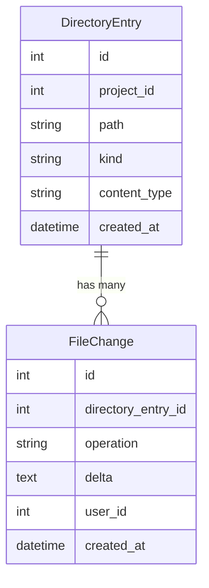
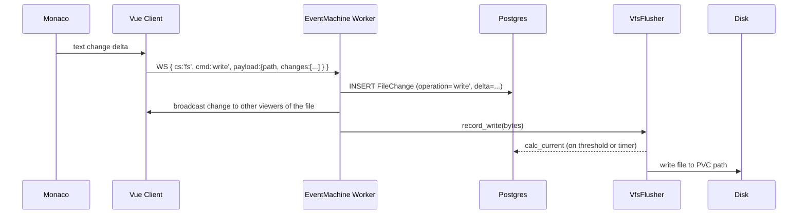

## Design principle

There is **no save step**. Every keystroke is immediately persisted. The database
*is* the filesystem. Disk is a flushed snapshot used by shell tools running in the pod.

## Decision: linear revision log, server authoritative

CARB/IDE2 currently uses a **server-authoritative linear revision log** for collaborative edits.

Why this is the right fit right now:
- Simple to reason about and debug.
- Low-latency behavior is good enough for current collaborative sessions.
- Fast to ship and operate without CRDT complexity at this stage.
- Durable-by-default, because revisions are appended and replayable.

Tradeoff:
- This model is less resilient to complex concurrent-edit edge cases than OT/CRDT.

Planned evolution:
- Keep the current revision log as the durable substrate.
- Introduce OT/CRDT later as a higher-level sync protocol when product needs justify it.
- Preserve backward compatibility by treating revision replay as the source of truth.

## Data model



### `DirectoryEntry`

One row per file or folder in the project's DBFS. Stores metadata only — no content.

- `kind`: `'file'` | `'folder'`
- `path`: absolute DBFS path (e.g. `/src/app.js`)

### `FileChange`

Append-only log of every mutation to a file.

- `operation`: `'write'` | `'set_contents'` | `'create'` | `'delete'` | `'rename'`
- `delta`: the change payload (full content for `set_contents`, linear server-validated delta for `write`)

## Reading a file: `calc_current`

`DirectoryEntry#calc_current` replays all `FileChange` rows for that entry in
creation order, producing the current file content. There is no "latest version"
column — the truth is always in the log.

```ruby
# Simplified
def calc_current
  changes.order(:id).reduce('') do |content, change|
    apply_delta(content, change)
  end
end
```

## Write path (FsStore → VfsFlusher)



## Flush triggers (VfsFlusher)

Two flush triggers run in the background:

| Trigger | Condition | Default |
|---------|-----------|---------|
| Periodic sweep | every N ms | 800 ms (`VFS_FLUSH_INTERVAL_MS`) |
| Byte threshold | accumulated unflushed bytes ≥ T | 20 bytes (`VFS_FLUSH_THRESHOLD_BYTES`) |

Both thresholds are configurable via environment variables.

## FsStore commands

`FsStore` handles the `fs` commandSet over WebSocket:

| Command | Description |
|---------|-------------|
| `tree` | List directory entries for a path |
| `read` | Read file content (`calc_current`) |
| `read_binary` | Read binary file (Base64) |
| `stat` | Metadata for a path |
| `write` | Append a write delta |
| `set_contents` | Replace full file content |
| `create_file` | Create a new file entry |
| `mkdir` | Create a folder entry |
| `rename` | Rename a path |
| `delete` | Delete an entry |

## Source files

| File | Role |
|------|------|
| `worker/fs_store.rb` | WS command handler for `cs: 'fs'` |
| `worker/vfs_flusher.rb` | Background DBFS flush loop (timer + threshold) |
| `app/models/directory_entry.rb` | DBFS entry model + `calc_current` |
| `app/models/file_change.rb` | Append-only change log model |
| `lib/tasks/fs.rake` | Rake tasks for DBFS inspection |
