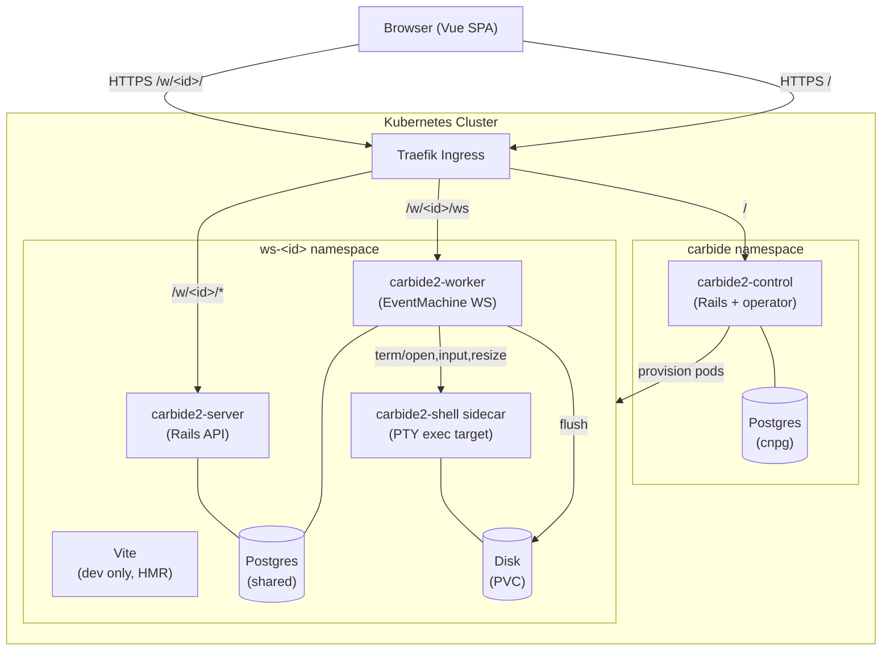

## System diagram



## Request paths

### REST API (carbide2-server)

```
Browser → Traefik → Rails /api/* → ActiveRecord → Postgres
```

Authentication via JWT (see [Authentication & JWT](/architecture/authentication/)).

### WebSocket (carbide2-worker)

```
Browser → Traefik → EventMachine worker
  → { cs: 'fs', cmd: 'write', payload: { path, changes: [...] } }
  → FileChange row in Postgres
  → broadcast change to other viewers of that file
  → VfsFlusher: write to disk (PVC) on threshold / timer
```

### Terminal path (PTY sidecar)

```
Browser → Traefik → EventMachine worker (term/create)
  → ensure per-project shell sidecar is running
  → PTY exec attaches into shell sidecar (not server/worker process namespaces)
  → sidecar mounts only the project filesystem root
  → terminal tools operate on project files, not server/worker internals
```

### Control plane

```
Browser → Traefik → carbide2-control Rails /api/workspaces
  → k8s operator creates Workspace CR
  → operator reconciles: creates Helm release in ws-<id>
```

## Process model (per workspace pod)

Three processes supervised by **Foreman** (`Procfile`) plus one shell sidecar backend:

| Process | Command | Purpose |
|---------|---------|---------|
| `web` | `bundle exec rails server` | REST API + SPA asset serving |
| `worker` | `ruby worker/worker.rb` | EventMachine WS server |
| `vite` | `npm run dev` (dev only) | HMR for Vue SPA |
| `carbide2-shell` (sidecar) | spawned/managed by terminal backend | PTY exec target with project-filesystem-only mount |

## Data storage

| Store | Used for |
|-------|---------|
| Postgres (`FileChange`, `DirectoryEntry`) | All file content and metadata — the DBFS |
| Postgres (`ChatMessage`, `TerminalRecording`, `Agent*`) | Collaboration history |
| Disk (PVC) | Flushed DBFS snapshots, used by dev tools running in the pod |
| Postgres (`User`, `Project`, `ProjectMembership`) | Identity and access |

See [Filesystem (DBFS)](/architecture/filesystem/) for detail on the DBFS design.
