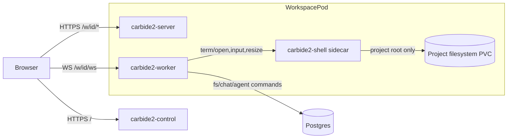

## Ownership map

| Subsystem | Primary repo | Owns | Does not own |
|-----------|--------------|------|--------------|
| Control plane | `carbide2-control` | User sessions, workspace lifecycle, k8s reconciliation | Workspace runtime behavior (`fs`, `term`, `chat`, `agents`) |
| Workspace API | `carbide2-server` | `/api` endpoints, auth checks, DB models, project settings | WebSocket command handling internals |
| Realtime worker | `carbide2-worker` | `cs/cmd` WS protocol, fanout, PTY orchestration, DBFS watcher/flusher | Control-plane provisioning logic |
| Terminal sidecar | workspace shell backend | Command execution environment for terminal sessions | Rails/worker process namespaces |
| Client SPA | `carbide2-client` | UI state, WS/REST clients, rendering | Server-side authorization semantics |

## Runtime boundaries

## New-developer "where do I edit" cheatsheet

| Task | Start here |
|------|------------|
| Add WS command | `worker/handlers/*_handlers.rb` and [WebSocket Commands](/api-reference/websocket-commands/) |
| Change terminal behavior | `worker/terminal_instance.rb`, `worker/project_pod.rb` |
| Change file-tree/DBFS behavior | `worker/fs_store.rb`, `app/models/directory_entry.rb`, `app/models/file_change.rb` |
| Add REST endpoint | `app/controllers/api/*`, `config/routes.rb`, [Server API](/api-reference/server/) |
| Change workspace provisioning | `carbide2-control` operator + `/api/workspaces` |
| Change dashboard/workspace UI | `carbide2-client/src/*` |

## Boundary rules

1. Control plane creates and tears down workspaces; it does not execute workspace commands.
2. Worker executes realtime protocol and terminal fanout; Rails models remain source of truth.
3. Terminal tools run in sidecar context and should see only the project filesystem mount.
4. Any contract change (REST or WS) must update API docs in the same change.
